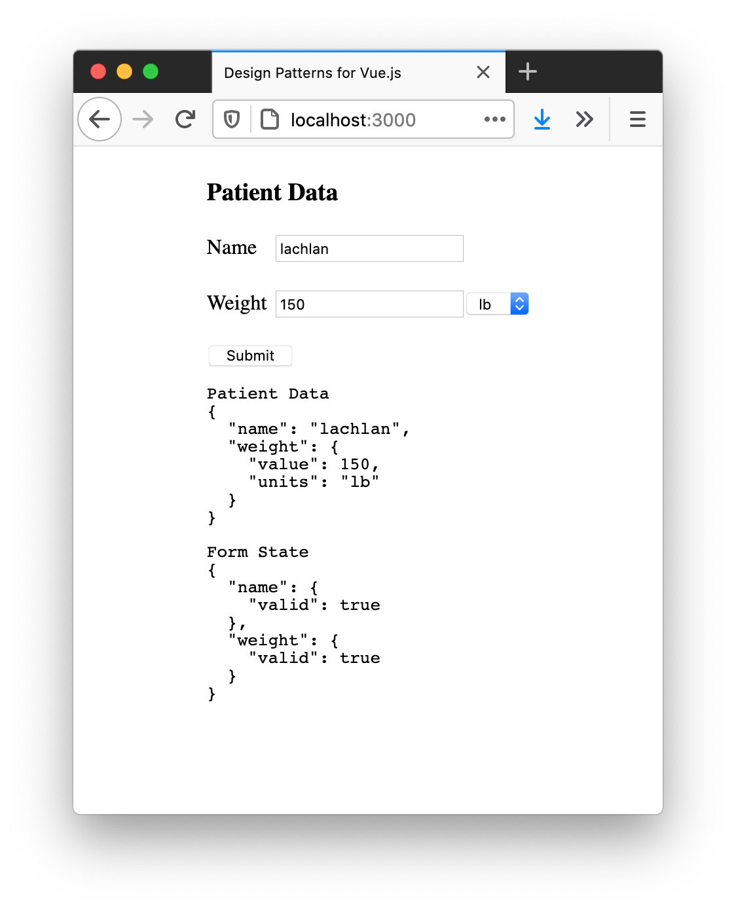

# Writing Testable Forms

Forms are the primary way a user enters information into any web based system, so getting them right is important. The focus on this section will be on forms, specifically *writing good forms*. What exactly is a *good* form? We want to ensure the form logic is decoupled from the Vue components - this will let us test in isolation. We also need to think about validation. In traditional server rendered apps, you would only get validation after submitting the form - not really a great user experience. Vue makes client side validation trivial, so we will make use of this and implement two levels of validation:

1. Field validation - if a user enters incorrect in invalid data in a single field, we will show an error immediately.
2. Form validation - the submit button should only be enabled when the entire form is correctly filled out.

Finally, we need two levels of tests. The first is around the business logic; given some form, which fields are invalid, and when is the form considered complete? The second is around interactions - ensuring that the UI layer is working correctly, and that the user can enter data, see error messages, and correctly submit the form.

## The Patient Form

For this example, we are building a form to enter patient data for a hospital application. The form will look like this:

### Img: Invalid Form with Debug Info


### Img: Valid Form with Debug Info


There are two inputs. The first is the patient name, which is required and can be any text. The second is the patient weight, which can be in imperial or metric units. The constraints are as follows:

 .  | Imperial | Metric
--- | --- | ---
min | 66 | 30
max | 440 | 200

We could define those using an object:

```js
const limits = {
  kg: { min: 30, max: 200 },
  lb: { min: 66, max: 440 }
}
```

The submit button should only be enabled if both inputs are valid. Finally, we should show validation for each field.

## A Mini Form Validation Framework

There are plenty of full-featured Vue (and non-Vue) form validation frameworks out there. For this simple example, we will write our own. We have two types of validations: a required field (the patient name) and a required field with specific constraints (the weight field). We also want to return an error message, if the input is not valid. This will help guide the user.

We need two validation functions: `required` and `isBetween`. While TDD isn't always the right tool, for these two functions I believe it is. We know the inputs and outputs, and all the possible states of the system. 

Let's write some tests, starting with `required`. Each validator will return an object with the validation status, and a message if there is an error. Using a TypeScript `interface` to notation purposes:

```js
interface ValidationResult {
  valid: boolean
  messsage?: string
}
```

Now we've settled on our validation API, here are the tests for `required`.

## The `required` validator


```js
import {
  required,
} from './form.js'

describe('required', () => {
  it('is invalid when undefined', () => {
    expect(required(undefined)).toEqual({ 
      valid: false, 
      message: 'Required' 
    })
  })

  it('is invalid when empty string', () => {
    expect(required('')).toEqual({ 
      valid: false, 
      message: 'Required' 
    })
  })

  it('returns true false value is present', () => {
    expect(required('some value')).toEqual({ valid: true })
  })
})
```

Basically, anything that is not truthy is invalid; anything else is considered valid. We can get all the tests passing with this implementation:

```js
export function required(value) {
  if (!value) {
    return {
      valid: false,
      message: 'Required'
    }
  }

  return { valid: true }
}
```

I like to put the invalid case first for my validators - that's just a personal preference.

## The `isBetween` validator

`isBetween` is a bit more interesting. We need to support imperial and metric; we will build another function on top of `isBetween` that will pass in the correct constraints.

Let's start by identifying all the edge cases. If the minimum weight is 66 lb and the maximum weight is 440 lb, obviously 65 lb and 441 lb are invalid. 66 lb and 440 lb are valid, however, so we should make sure we add tests for those cases. This means we need 5 tests; the happy path, where the input is valid, above/below the constraints, and equal to the minimum and maximum constraint.

We assume that only numbers can be passed as the input value; this validation is something we will handle at a higher level.

```js
import {
  required,
  isBetween
} from './form.js'

// ...

describe('isBetween', () => {
  it('returns true when value is equal to min', () => {
    expect(isBetween(5, { min: 5, max: 10 }))
    .toEqual({ valid: true })
  })

  it('returns true when value is between min/max', () => {
    expect(isBetween(7, { min: 5, max: 10 }))
    .toEqual({ valid: true })
  })

  it('returns true when value is equal to max', () => {
    expect(isBetween(10, { min: 5, max: 10 }))
    .toEqual({ valid: true })
  })

  it('returns false when value is less than min', () => {
    expect(isBetween(4, { min: 5, max: 10 }))
      .toEqual({ 
        valid: false, 
        message: 'Must be between 5 and 10' 
      })
  })

  it('returns false when value is greater than max', () => {
    expect(isBetween(11, { min: 5, max: 10 }))
      .toEqual({ 
        valid: false, 
        message: 'Must be between 5 and 10' 
      })
    })
})
```

I think the tests are simple enough to have everything in a single `expect` statement. If the tests were more complex, I'd probably assign the result of `isBetween()` to a variable (I like to call it `actual`) and pass that to the `expect` assertion.

The implementation is much less code than the tests; this is not unusual.

```js
export function isBetween(value, { min, max }) {
  if (value < min || value > max) {
    return {
      valid: false,
      message: `Must be between ${min} and ${max}`
    }
  }

  return { valid: true }
}
```

Again, I like to have the validation at the start of the function.

## Building `validateMeasurement` with `isBetween`

Now we have written our little validation framework (well, two functions), it's time to validate the patient weight. We will build a `validateMeasurement` function using `isBetween` and `required`. Since we are supporting imperial and metric, we will be passing the constraints as an argument - dealing with which one is selected will be later on, in the UI layer. We will want three tests: the happy path, when the value is valid, a test for a null value, and for a value outside the constraints. I don't feel the need to add tests for all the cases like we did with `isBetween`, since we already tested that.

```js
import {
  required,
  isBetween,
  validateMeasurement
} from './form.js'

// ...

describe('validateMeasurement', () => {
  it('returns invalid for input', () => {
    const constraints = { min: 10, max: 30 }
    const actual = validateMeasurement(undefined, { constraints })
    expect(actual).toEqual({ valid: false, message: 'Required' })
  })

  it('returns invalid when outside range', () => {
    const constraints = { min: 10, max: 30 }
    const actual = validateMeasurement(40, { constraints })
    expect(actual).toEqual({ 
      valid: false, 
      message: 'Must be between 10 and 30' 
    })
  })
})
```

Since the test is a bit more complex, I decided to assign the result to `actual`, and assert against that. I think this makes it more clear. We don't need to use the specific constraints outlined in the table earlier; as long as the tests pass with the constraints we pass in here, we can be confident `validateMeasurement` will work correctly for any given set of `min/max` constraints.

As you might expect, the implementation is much shorter than the test code:

```js
export function validateMeasurement(value, { constraints }) {
  const result = required(value)
  if (!result.valid) {
    return result
  }

  return isBetween(value, constraints)
}
```

Nice! We were able to reuse `required` and `isBetween`.

## The Form Object and Full Form Validation

We have completed all the validations for each field. Let's think about the shape of the form, now. We have two fields: `name` and `weight`. `name` is a string, and weight is a number with associated units. This is the *input*. Again, using TypeScript for notation:

```js
interface PatientFormState {
  name: string
  weight: {
    value: number
    units: 'kg' | 'lb'
  }
}

const patientForm: PatientFormState = {
  name: 'John',
  weight: {
    value: 445,
    units: 'lb'
  }
}
```

Given an input (a `patientForm`), we can valid each field. Fields when validated are either `{ valid: true }` or `{ valid: false, message: '...' }`. So the form and validity interfaces could look like this (again, using TypeScript for notation):


```js
interface PatientFormValidity {
  name: ValidationResult
  weight: ValidationResult
}

const patientForm: PatientFormState = {
  name: 'John',
  weight: {
    value: 445,
    units: 'lb'
  }
}

const validState = validateForm(patientForm)
// Result should be:
// {
//   name: { valid: true }
//   weight: { 
//     valid: false, 
//     message: 'Must be between 66 and 440' 
//   }
// }

```

We will need two functions: `isFormValid`, to tell us if the form is valid or not, and `patientForm`, which handles figuring out the correct weight units, and calling all the validators. Let's start with the tests for `isFormValid`. The form is considered valid when all fields are `valid`, so we only need two tests: the case where all fields are valid, and the case where at least one field is not: 

```js
import {
  required,
  isBetween,
  validateMeasurement,
  isFormValid
} from './form.js'

// ...

describe('isFormValid', () => {
  it('returns true when name and weight field are valid', () => {
    const form = {
      name: { valid: true },
      weight: { valid: true }
    }

    expect(isFormValid(form)).toBe(true)
  })

  it('returns false when any field is invalid', () => {
    const form = {
      name: { valid: false },
      weight: { valid: true }
    }

    expect(isFormValid(form)).toBe(false)
  })
})
```

The implementation is as simple as you might expect:

```js
export function isFormValid(form) {
  return form.name.valid && form.weight.valid
}
```

You could get fancy and iterate over the `form` using `Object.keys` or `Object.entries` if you were building a more generic form validation library; in this case we aren't, so I am keeping it as simple as possible.

The last test we need to complete the business logic is `patientForm`. This function takes an object with the `PatientFormState` shape we defined earlier and returns the validation result of each field. We will want to have a quite a few tests here, to make sure we don't miss anything. The cases I can think of are:

1. Happy path: all inputs are valid
2. Patient name is null
3. Patient weight is outside constraints (imperial)
4. Patient weight is outside constraints (metric)

```js
import {
  required,
  isBetween,
  validateMeasurement,
  isFormValid,
  patientForm
} from './form.js'

// ...

describe('patientForm', () => {
  const validPatient = {
    name: 'test patient',
    weight: { value: 100, units: 'kg' }
  }

  it('is valid when form is filled out correctly', () => {
    const form = patientForm(validPatient)
    expect(form.name).toEqual({ valid: true })
    expect(form.weight).toEqual({ valid: true })
  })

  it('is invalid when name is null', () => {
    const form = patientForm({ ...validPatient, name: '' })
    expect(form.name).toEqual({ valid: false, message: 'Required' })
  })

  it('validates weight in imperial', () => {
    const form = patientForm({ 
      ...validPatient, 
      weight: { 
        value: 65, 
        units: 'lb' 
      }
    })

    expect(form.weight).toEqual({ 
      valid: false, 
      message: 'Must be between 66 and 440' 
    })
  })

  it('validates weight in metric', () => {
    const form = patientForm({ 
      ...validPatient, 
      weight: { 
        value: 29, 
        units: 'kg' 
      }
    })

    expect(form.weight).toEqual({ 
      valid: false, 
      message: 'Must be between 30 and 200' 
    })
  })
})
```

The test code is quite long. Thankfully, the implementation is trivial. In this example, I am just hard-coding the weight constraints in an object called `limits`; in a real world system, you'd likely get these from an API and pass them down to the `patientForm` function.

```js
const limits = {
  kg: { min: 30, max: 200 },
  lb: { min: 66, max: 440 },
}

export function patientForm(patient) {
  const name = required(patient.name)

  const weight = validateMeasurement(patient.weight.value, {
    nullable: false,
    constraints: limits[patient.weight.units]
  })

  return {
    name,
    weight
  }
}
```

This completes the business logic for the patient form - noticed we haven't written and Vue components yet? That's because we are sticking to one of our goals; *separation of concerns*, and isolating the business logic entirely. 

## Writing the UI Layer

Now the fun part - writing the UI layer with Vue. Although I think TDD is a great fit for business logic, I prefer to write the tests for my components after the fact generally, although this doesn't follow the hardcore TDD mantra.

I like to start by thinking abou how I will manage the state of my component. Let's use the composition API; I think it lends itself well to forms.


```html
<script>
import { reactive, computed, ref } from 'vue'
import { patientForm, isFormValid } from './form.js'

export default {
  setup() {
    const form = reactive({
      name: '',
      weight: {
        value: '',
        units: 'kg'
      }
    })

    const validatedForm = computed(() => patientForm(form))
    const valid = computed(() => isFormValid(validatedForm.value))

    return {
      form,
      validatedForm,
      valid,
    }
  }
}
</script>
```

I decided to keep the state in a `reactive` object. Both the `valid` state and `validateForm` are `computed` values - we want the validation and form state to update reactively when any value in the form changes.

Let's add the `<template>` part now - it's very simple, just good old HTML.

```html
<template>
  <h3>Patient Data</h3>
  <form>
    <div class="field">
      <div v-if="!validatedForm.name.valid" class="error">
        {{ validatedForm.name.message }}
      </div>
      <label for="name">Name</label>
      <input id="name" name="name" v-model="form.name" />
    </div>
    <div class="field">
      <div v-if="!validatedForm.weight.valid" class="error">
        {{ validatedForm.weight.message }}
      </div>
      <label for="weight">Weight</label>
      <input 
        id="weight" 
        name="weight" 
        v-model.number="form.weight.value" 
      />
      <select name="weightUnits" v-model="form.weight.units">
        <option value="kg">kg</option>
        <option value="lb">lb</option>
      </select>
    </div>
    <div class="field">
      <button :disabled="!valid">Submit</button>
    </div>
  </form>
<pre>
Patient Data
{{ form }}
</pre>
<br />

<pre>
Form State
{{ validatedForm }}
</pre>
</template>
```

I added the `<pre>` block for some debugging. Everything works!

### Img: Validation Debug Info


## Some Basic UI Tests

We can add some basic UI tests using Vue Test Utils, too. Here are two fairly simple ones that cover most of the functionality:

```js
import { mount } from '@vue/test-utils'
import FormValidation from './form-validation.vue'

describe('FormValidation', () => {
  it('fills out form correctly', async () => {
    const wrapper = mount(FormValidation)

    await wrapper.find('#name').setValue('lachlan')
    await wrapper.find('#weight-units').setValue('lb')
    await wrapper.find('#weight').setValue('150')

    expect(wrapper.findAll('.error')).toHaveLength(0)
  })

  it('shows errors for invalid inputs', async () => {
    const wrapper = mount(FormValidation)

    await wrapper.find('#name').setValue('')
    await wrapper.find('#weight-units').setValue('lb')
    await wrapper.find('#weight').setValue('50')

    expect(wrapper.findAll('.error')).toHaveLength(2)
  })
})
```

We don't have any tests to ensure the `<button>` is correctly disabled - see below for more.

## Improvements and Conclusion

The goal here wasn't to build the *perfect* form, but illustrate how to separate your form validation and business logic from the UI layer. 

As it stands, you can enter any string into the weight field and it will be considered valid - not ideal, but also trivial to fix. A good exercise would be to write some tests to ensure the input is a number, and if not, return a useful error message. We also haven't got any tests to ensure the `<button>` is correctly disabled.

## Exercises

- add a test to ensure that any non numbers entered into the `weight` field cause the field to become invalid and show a "Weight must be a number" error.
- add a `@submit.prevent` listener to the `<form>`. When the form is submitted, emit an event with the `patientForm`.
 - submit the form using Vue Test Utils and assert the correct event and payload is emitted.

You can find the completed source code (including exercises) in the [GitHub repository](https://github.com/lmiller1990/design-patterns-for-vuejs-source-code): https://github.com/lmiller1990/design-patterns-for-vuejs-source-code.

\pagebreak
