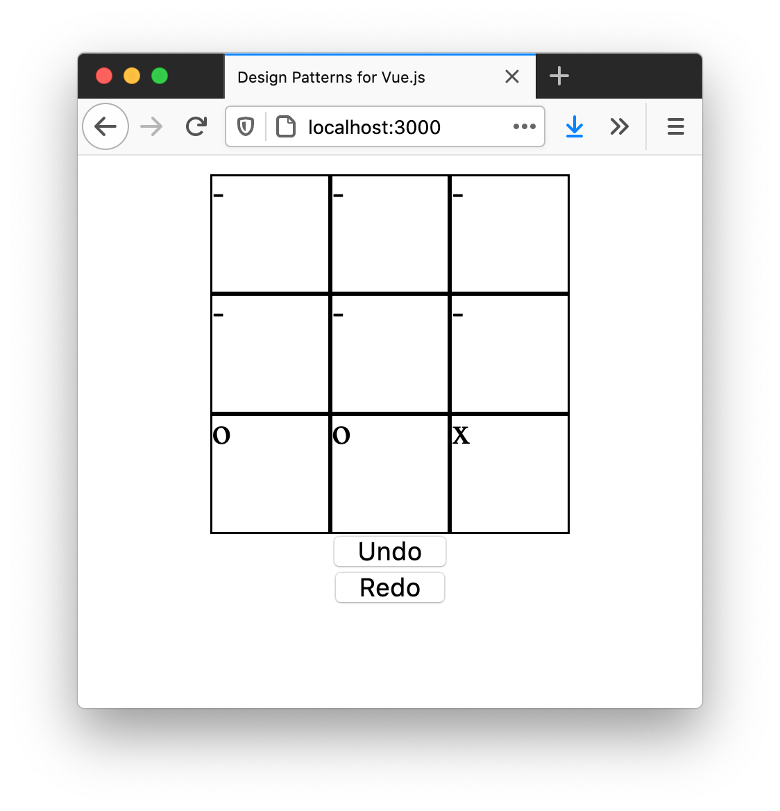
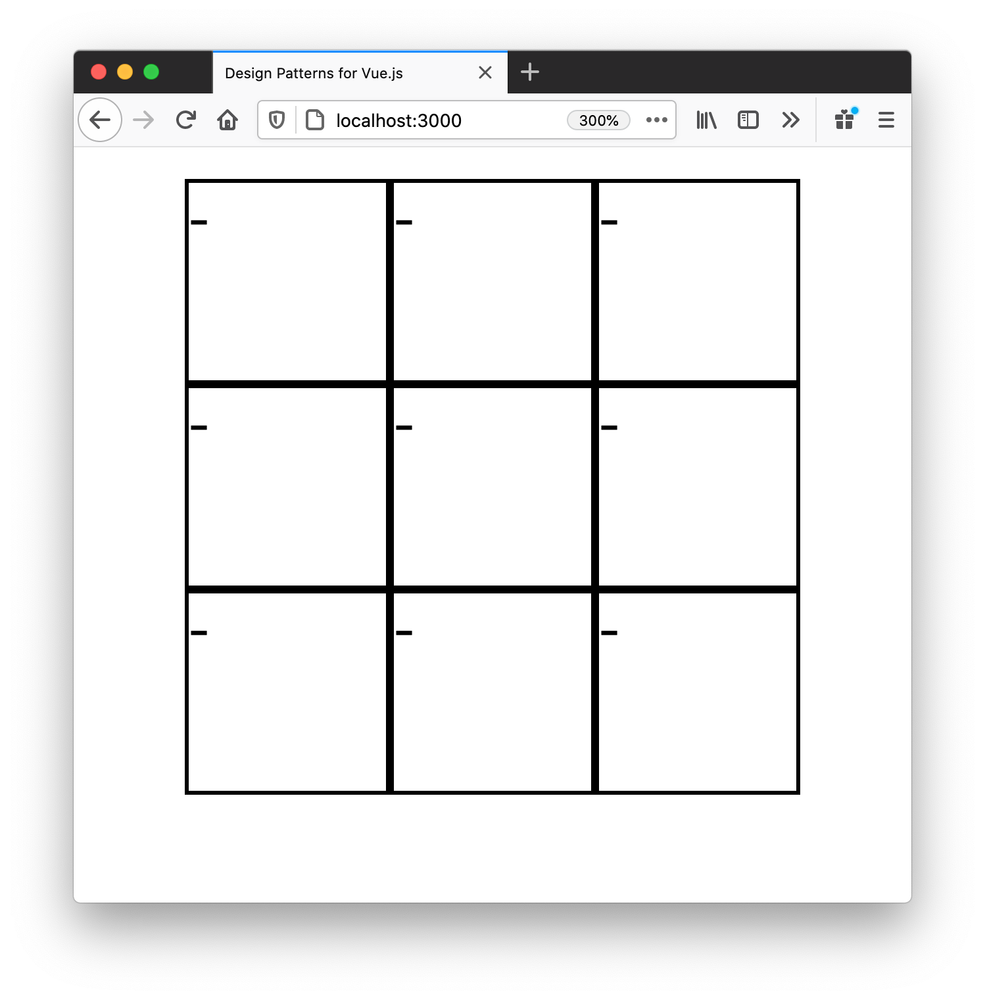

# Grouping Features with Composables

The completed source code for this section, including the exercises, can be found in `examples/composition`.

______

Vue 3's flagship feature is The Composition API; it's main selling point is to easily group and reuse code by *feature*. In this section we will see some techniques to write testable composables by building a tic tac toe game, including undo and redo.

### Img: Completed Game



The API we will end with looks like this:

```js
export default {
  setup() {
    const { currentBoard, makeMove } = useTicTacToe()

    return {
      makeMove,
      currentBoard
    }
  }
}
```

`currentBoard` is a `computed` property that looks like this:

```js
[
  ['x', 'o', '-'],
  ['x', 'o', 'x'],
  ['-', 'o', '-']
]
```

`makeMove` is a function that takes two arguments: `col` and `row`. Given this board:

```js
[
  ['-', '-', '-'],
  ['-', '-', '-'],
  ['-', '-', '-']
]
```

Calling `makeMove({ row: 0, col: 1 })` would yield the following board (where `o` goes first)

```js
[
  ['-', 'o', '-'],
  ['-', '-', '-'],
  ['-', '-', '-']
]
```

While we won't do it here, I'd like to have a "history" feature, so we can replay the game and see how things progressed. We will keep this in mind as we develop. Implementing this will be an exercise, and the solution will be included in the final source code.

Finally, we want to consider two potential use cases for the composable. One is to allow many different components to update or access the same game of tic tac toe. Another is to support having many simultaneous games of tic tac toe running at once.

## Defining the Initial Board

Let's start with some way to maintain the game state. I will call this variable `initialBoard`:

```js
const initialBoard = [
  ['-', '-', '-'],
  ['-', '-', '-'],
  ['-', '-', '-']
]
```

Before diving too far into the game logic, let's get something rendering. Remember we want to keep a history of the game? This means instead of mutating the game state, we should just create a new game state for each and push it into an array. We also need the board to be reactive, so Vue will update the UI. We can use `ref` for this. Update the code:

```js
import { ref, readonly } from 'vue'

export function useTicTacToe() {
  const initialBoard = [
    ['-', '-', '-'],
    ['-', '-', '-'],
    ['-', '-', '-']
  ]

  const boards = ref([initialBoard])

  return {
    boards: readonly(boards)
  }
}
```

I made the board `readonly`; I don't want to update the game state direct in the component, but via a method we will write soon in the composable.

Let's try it out! Create a new component and use the `useTicTacToe` function:

```html
<template>
  <div v-for="row, rowIdx in boards[0]" class="row">
    <div 
      v-for="col, colIdx in row" 
      class="col" 
    >
      {{ col }}
    </div>
  </div>
</template>

<script>
import { useTicTacToe } from './tic-tac-toe.js'

export default {
  setup() {
    const { boards } = useTicTacToe()

    return {
      boards
    }
  }
}
</script>

<style>
.row {
  display: flex;
}

.col {
  border: 1px solid black;
  height: 50px;
  width: 50px;
}
</style>
```

Great! It works:

### Img: Rendered game board



## Computing the Current State

Currently the component is hard coded to use `boards[0]`. What we really want to do is use the last element, which is the latest game state. We can use a `computed` property for this. Update the composable:

```js
import { ref, readonly, computed } from 'vue'

export function useTicTacToe() {
  const initialBoard = [
    ['-', '-', '-'],
    ['-', '-', '-'],
    ['-', '-', '-']
  ]

  const boards = ref([initialBoard])

  return {
    boards: readonly(boards),
    currentBoard: computed(() => boards.value[boards.value.length - 1])
  }
}
```

Update the component to use the new `currentBoard` computed property:

```html
<template>
  <div v-for="row, rowIdx in currentBoard" class="row">
    <div 
      v-for="col, colIdx in row" 
      class="col" 
    >
      {{ col }}
    </div>
  </div>
</template>

<script>
import { useTicTacToe } from './tic-tac-toe.js'

export default {
  setup() {
    const { boards, currentBoard } = useTicTacToe()

    return {
      boards,
      currentBoard
    }
  }
}
</script>
```

Everything is still working correctly. Let's make sure everything continues to work correctly by writing some tests.

## Tests

We've written a little too much code without any tests for my liking. Now is a good time to write some, which will reveal some (potential) problems with our design.

```js
import { useTicTacToe } from './tic-tac-toe.js'

describe('useTicTacToe', () => {
  it('initializes state to an empty board', () => {
    const initialBoard = [
      ['-', '-', '-'],
      ['-', '-', '-'],
      ['-', '-', '-']
    ]
    const { currentBoard } = useTicTacToe()

    expect(currentBoard.value).toEqual(initialBoard)
  })
})
```

This does pass, but also reveals some potential issues. Firstly, we want to test our business logic (the game logic, in this case). We had to use `.value` in the test, though, to access the current state of the game. We need `.value` since `currentBoard` is a `computed` property - part of Vue's reactivity system. In other words, the UI layer. 

We have tightly coupled our implementation to Vue. You could not reuse this logic in another framework, like React, for example. This is a relatively simple composable and a coupling I am happy to live with for now, but it's still worth recognizing it and considering the implications this might have in the future, should we decide to move away from Vue.

While moving away from your UI framework, in this case Vue, might seem unlikely, but we thought the same thing about jQuery, Backbone and Angular.js. For this simple example I think this coupling is acceptable. If we start to write signficantly complex business logic, we may want to consider removing the coupling between the composable and the business logic. In this next chapter, we explore how to reduce coupling between UI and business logic in composables. We also discuss *why* this might be desirable.

Back to the current example. There is no easy way to pre-set the game state - we currently cannot test a scenario where many moves have been played, without actually playing the game. This means we need to implement `makeMove` before writing tests to see if the game has been won, since there is no way to update the board as it stands to test winning or losing scenarios. We can work around this by passing in an intiial state to `useTicTacToe`, for example `useTicTacToe(initialState)`.

## Setting an Initial State

Update `useTicTacToe` to receive an `initialState` argument to facilitate easier testing:

```js
import { ref, readonly, computed } from 'vue'

export function useTicTacToe(initialState) {
  const initialBoard = [
    ['-', '-', '-'],
    ['-', '-', '-'],
    ['-', '-', '-']
  ]

  const boards = ref(initialState || [initialBoard])

  return {
    boards: readonly(boards),
    currentBoard: computed(() => boards.value[boards.value.length - 1])
  }
}
```

Add a test to ensure we can seed an initial state:

```js
describe('useTicTacToe', () => {

  it('initializes state to an empty board', () => {
    // ...
  })

  it('supports seeding an initial state', () => {
    const initialState = [
      ['o', 'o', 'o'],
      ['-', '-', '-'],
      ['-', '-', '-']
    ]
    const { currentBoard } = useTicTacToe([initialState])

    expect(currentBoard.value).toEqual(initialState)
  })
})
```

Notice we pass in `[initialState]` as an array - we are representing the state as an array to preserve the history. This allows us to seed a fully completed game, which will be useful when writing the logic to see if a player has won.

With this refactor, we can seed the initial state. This will be especially useful for testing different scenarios and asserting whether the game has been won or not.

## Making a Move

The final feature we will add is the ability for a player to make a move. We need to keep track of the current player, and then update the board by pushing the next game state into `boards`. Let's start with a test:

```js
describe('makeMove', () => {
  it('updates the board and adds the new state', () => {
    const game = useTicTacToe() 
    game.makeMove({ row: 0, col: 0 })

    expect(game.boards.value).toHaveLength(2)
    expect(game.currentPlayer.value).toBe('x')
    expect(game.currentBoard.value).toEqual([
      ['o', '-', '-'],
      ['-', '-', '-'],
      ['-', '-', '-']
    ])
  })
})
```

There isn't anything too surprising here. After making a move, we have two game states (initial and the current one). The current player is now `x` (since `o` goes first). Finally, the `currentBoard` should be updated.

The implementation is quite simple, too. We are using `JSON.parse(JSON.stringify())`, which feels pretty dirty - see below to find out why.

```js
export function useTicTacToe(initialState) {
  const initialBoard = [
    ['-', '-', '-'],
    ['-', '-', '-'],
    ['-', '-', '-']
  ]

  const boards = ref(initialState || [initialBoard])
  const currentPlayer = ref('o')

  function makeMove({ row, col }) {
    const newBoard = JSON.parse(JSON.stringify(boards.value))[boards.value.length - 1]
    newBoard[row][col] = currentPlayer.value
    currentPlayer.value  = currentPlayer.value === 'o' ? 'x' : 'o'
    boards.value.push(newBoard)
  }


  return {
    makeMove,
    boards: readonly(boards),
    currentPlayer: readonly(currentPlayer),
    currentBoard: computed(() => boards.value[boards.value.length - 1])
  }
}
```

This gets the test to pass. As mentioned above we are using the somewhat dirty `JSON.parse(JSON.stringify(...))` to clone the board and lose reactivity. I want to get *non reactive* copy of the board - just a plain JavaScript array. Somewhat surprisingly, `[...boards.value[boards.value.length - 1]]` does not work - the new object is still reactive and updates when the source array is mutated. This means we are mutating the game history in `boards`! Not ideal. 

I would like to find a cleaner way to do this, and will update this section when I do. If you know a better way of getting a non-reactive copy of a `ref`, please let me know.

Either way, this works fine for now. Let's update the usage:

```html
<template>
  <div v-for="row, rowIdx in currentBoard" class="row">
    <div 
      v-for="col, colIdx in row" 
      class="col" 
      @click="makeMove({ row: rowIdx, col: colIdx })"
    >
      {{ col }}
    </div>
  </div>
</template>

<script>
import { useTicTacToe } from './tic-tac-toe.js'

export default {
  setup() {
    const { boards, currentBoard, makeMove } = useTicTacToe()

    return {
      boards,
      currentBoard,
      makeMove
    }
  }
}
</script>
```

### Img: Completed game board

That's it! Everything now works in it's functional, immutable glory.

The game is now playable - well, you can make moves. There are a number of problems:

1. No way to know if a player has won. 
2. You can make an invalid move (for example, going on a square that is already taken). 
3. We did not implement undo/redo.

Fixing/implementing these is not very difficult and will be left as an exercise. You can find the solutions in the source code. Undo/redo is probably the most interesting one - you should definitely try and implement this yourself before looking at the answers.

## Conclusion

We saw how you can isolate business logic in a composable, making it testable and reusable. We also discussed some trade-offs of our approach - namely, coupling the business logic to Vue's reactivity system. This concept will be further explored in the next section.

## Exercises

1. Write some tests with Vue Test Utils to ensure the UI is working correctly.
2. Do not allow moving on a square that is already taken.
3. Add a check after each move to see if a player has won. Display this somewhere in the UI.
4. Implement `undo` and `redo`.

You can find the completed source code in the [GitHub repository under examples/composition](https://github.com/lmiller1990/design-patterns-for-vuejs-source-code): https://github.com/lmiller1990/design-patterns-for-vuejs-source-code.

\pagebreak
